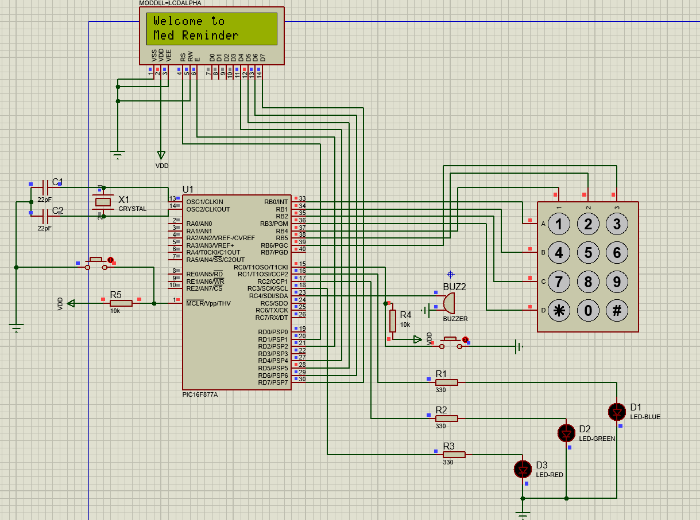
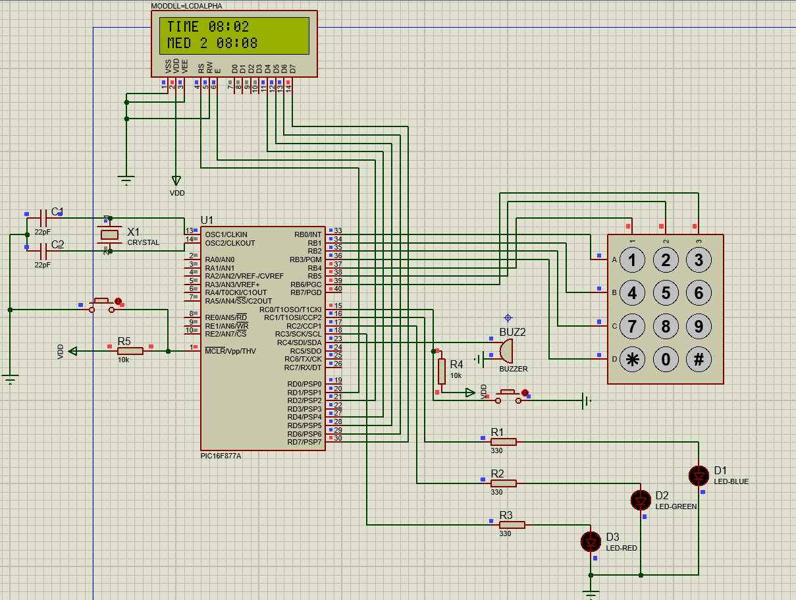

# Medicine Reminder System

**ENCS4330  (Real-Time Applications & Embedded Systems)**  
**PIC16F877A assembly + Proteus**

---

## What it does

- Welcome screen (~2 seconds).
- User sets the current time (`HH:MM`), then one daily time for Medicine 1, 2, and 3.
- `#` confirms, `*` clears. Invalid times (for example `27:80`) are rejected.
- Line 1: running software clock. Line 2: next medicine and its time.
- The clock is updated from a **Timer0 interrupt** (not delay loops).  
  **1 real second ≈ 1 simulated minute** 
- At a reminder: one LED blinks, buzzer sounds, LCD shows `Take Medicine n`.
- ACK button → `Dose Taken` (~2 s). No ACK for 20 simulated seconds → `Dose Missed` (~2 s).
- ACK is ignored when no reminder is active.
- Same reminder time: lower medicine number first, then the next one immediately.
- After all doses today, line 2 shows the earliest time **tomorrow**.
- After 23:59 the clock goes to 00:00 and the same three reminders can fire again.

---

## Hardware (Proteus)

**PIC16F877A**  
The microcontroller. It runs the assembly program: clock, keypad, LCD, LEDs, buzzer, and reminders.

**4 MHz crystal + 2 capacitors**  
Gives the PIC a stable XT clock on OSC1/OSC2. One instruction ≈ 1 µs. Needed for Timer0 and all delays.

**MCLR 10 kΩ pull-up**  
Holds pin 1 at 5 V so the PIC can run. Without this pull-up, MCLR can float and the chip stays in reset.

**Reset button**  
Connects MCLR to GND when pressed. Restarts the program from Welcome without Stop/Play in Proteus.

**16×2 LCD (4-bit, LM016L)**  
Shows messages: Welcome, set time, current clock, next medicine, Take Medicine n, Dose Taken / Missed.

**Keypad 3×4**  
Used to type `HH:MM`. Digits `0–9`, `*` clears, `#` confirms. 

**ACK push button + 10 kΩ pull-up**  
The user presses it to say the dose was taken. RC0 goes to 0 when pressed. The 10 kΩ is required because PORTC has no weak pull-ups. Ignored when no reminder is active.

**LED 1, LED 2, LED 3 + series resistors**  
Each LED is for one medicine. Only one LED blinks at a time during an alert so the user knows which medicine to take.

**Buzzer**  
Makes a sound with the alert (toggled on RC4) so the user hears the reminder.

**Resistors, 5 V, and GND**  
Power the PIC and LCD, limit LED current, and pull up MCLR and ACK.

### PIC pinout (matches `MAIN.s`)

| Function | Pin |
|---|---|
| LCD RS | RD1 |
| LCD E | RD2 |
| LCD D4–D7 | RD4–RD7 |
| LCD R/W | GND |
| LCD VSS | GND |
| LCD VDD | 5 V |
| LCD VEE | GND |
| Keypad rows | RB0–RB3 (outputs) |
| Keypad columns | RB4–RB6 (inputs, PORTB weak pull-ups on) |
| ACK | RC0 (input) |
| LED1 / LED2 / LED3 | RC1 / RC2 / RC3 |
| Buzzer | RC4 |

---

## Program structure

The program is split into subroutines. `main` only initializes and calls them.

- **LCD:** `LCD_Init`, `LCD_Command`, `LCD_Data`, `LCD_Nibble`, `LCD_Clear`, plus the display screens (`Display_Welcome`, `Display_Set_Time`, `Display_Current_Time`, `Display_Reminder_Message`, `Display_Dose_Taken`, `Display_Dose_Missed`)
- **Keypad:** `Keypad_GetKey`, `Keypad_CheckColumns`, `Delay_Debounce`
- **Timer:** `Timer0_Init`, `Timer0_ISR`
- **Buzzer:** `Buzzer_Tone`
- **LED:** `Reminder_LED_On`, `Reminder_LED_Off`, `Alert_Outputs_Off`
- **Reminder checking:** `Check_Reminder`, `Check_Queued_Reminder`, `Find_Next_Medicine`, `Check_Med1_Next` / `Check_Med2_Next` / `Check_Med3_Next`

---

## How the clock math works

Fosc = 4 MHz, so one instruction cycle is 1 µs.  
Timer0 uses prescaler 1:32 and overflows every 256 counts → 256 × 32 = 8192 µs.  
The ISR counts overflows. After **122** overflows: 122 × 8192 µs ≈ **1 second**.  
That 1 real second is treated as **1 simulated minute** (allowed for a faster Proteus demo).  
After 60 simulated minutes the hour increases; after 23:59 the clock returns to 00:00.

---

## How to build the HEX (MPLAB X)

1. Open `MedReminder.X` in **MPLAB X**.
2. Compiler: **XC8** (pic-as). Device: **PIC16F877A**.
3. Runtime: do **not** link the C startup / C library (assembly-only project). Source files: `MAIN.s` and `xc8_link_stubs.s`.
4. **Run → Clean and Build Main Project** (not Debug).
5. HEX:

`MedReminder.X/dist/default/production/MedReminder.X.production.hex`

Debug builds do **not** keep a `.hex` file.

---

## How to run in Proteus

1. Open the schematic (`.pdsprj`).
2. Double-click the PIC → **Program File** = the **production** HEX above.
3. Processor clock: **XT, 4 MHz**.
4. Play.

---
## Suggested tests

| Test | Expected |
|---|---|
| Power on | `Welcome to` / `Med Reminder` ~2 s, then `SET TIME` |
| `27:80` + `#` | `INVALID` ~1 s, then set time again |
| Clock `08:00`, Med1 `08:01` | At 08:01: Take Medicine 1, LED1, buzzer |
| ACK | `Dose Taken` ~2 s, back to clock |
| No ACK ~20 s | `Dose Missed` ~2 s |
| ACK on clock screen | Nothing |
| Med1 and Med2 both `08:05` | Med1 first, then Med2 at once after Taken/Missed |
| Med3 `08:10` while 8:05 alerts run | Med3 still alerts (late catch-up, same hour) |
| Clock `23:58`, Med1 `00:04` | Does **not** alert at 23:58. Wrap `23:59→00:00`, alert at **00:04** |
| All three served | Line 1 still runs. Line 2 = earliest **next day** (not the last med today) |

reset button on MCLR restarts Welcome without Stop/Play.

---
## CONFIG (PIC)

- `FOSC = XT` — 4 MHz crystal  
- `WDTE = OFF` — watchdog off (long waits / keypad; no `CLRWDT`)  
- `PWRTE = ON` — ~72 ms after power/reset  
- `BOREN = OFF` — not needed in Proteus 5 V  
- `LVP = OFF` — RB3 is a keypad pin  
- `CP` / `CPD` / `WRT` = OFF — chip not locked  

---

